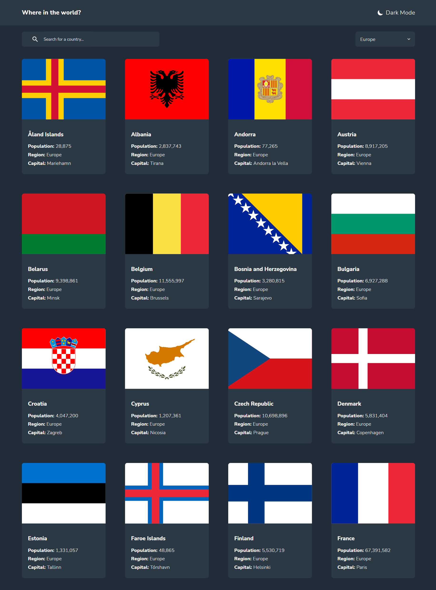

# Frontend Mentor - REST Countries API with color theme switcher solution

This is a solution to the [REST Countries API with color theme switcher challenge on Frontend Mentor](https://www.frontendmentor.io/challenges/rest-countries-api-with-color-theme-switcher-5cacc469fec04111f7b848ca). Frontend Mentor challenges help you improve your coding skills by building realistic projects. 

## Table of contents

- [Overview](#overview)
  - [The challenge](#the-challenge)
  - [Screenshot](#screenshot)
  - [Links](#links)
- [My process](#my-process)
  - [Built with](#built-with)
  - [What I learned](#what-i-learned)
  - [Continued development](#continued-development)
- [Author](#author)

**Note: Delete this note and update the table of contents based on what sections you keep.**

## Overview

### The challenge

Users should be able to:

- See all countries from the API on the homepage
- Search for a country using an `input` field
- Filter countries by region
- Click on a country to see more detailed information on a separate page
- Click through to the border countries on the detail page
- Toggle the color scheme between light and dark mode *(optional)*

### Screenshot

### Links

- Solution URL: [https://github.com/kamiliano1/Countries-API-with-color-theme-switcher](https://github.com/kamiliano1/Countries-API-with-color-theme-switcher)
- Live Site URL: [https://extraordinary-raindrop-87ace4.netlify.app/](https://extraordinary-raindrop-87ace4.netlify.app/)

## My process

### Built with

- Semantic HTML5 markup
- CSS custom properties
- Flexbox
- CSS Grid
- Mobile-first workflow
- Local Storage for saving actual theme mode
- [Rest Countries API](https://restcountries.com/) - API for countires details
- [React](https://reactjs.org/) - JS library
- [React Router](https://reactrouter.com/en/main) - JS library
- [Tailwind CSS](https://tailwindcss.com/) - Tailwind CSS
- [Icons](https://icones.js.org/) - For icons

### What I learned

This was my second time working with Tailwind CSS. For the text formatting, I'm going well but I still have a problem with preparing properly grid templates according to the design.

### Continued development

This project might be extended by filtering country by population or giving a user abilitiy to add additional information that is provided by API but wasn't included in the web.

## Author

- Website - [Kamil Szymon](https://github.com/kamiliano1)
- Frontend Mentor - [@kamiliano1](https://www.frontendmentor.io/profile/kamiliano1)

